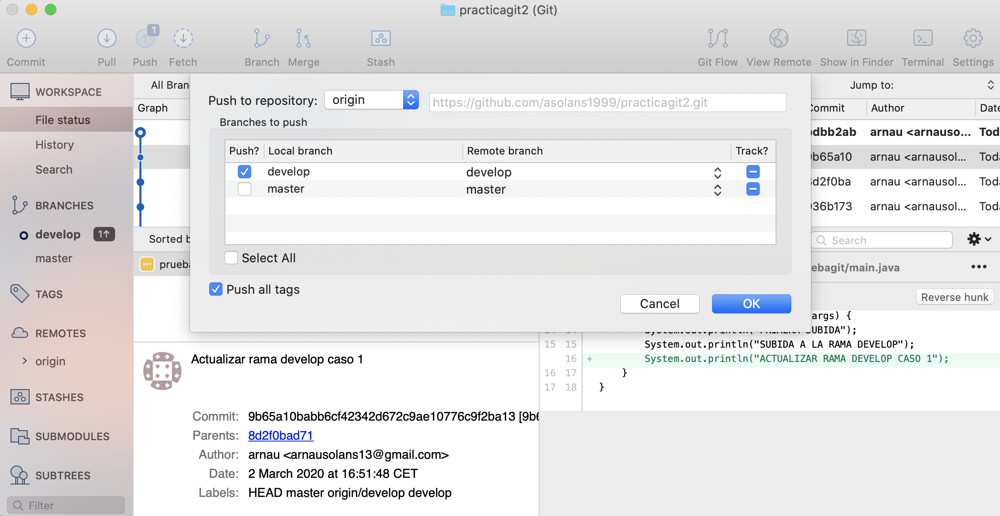

# practicagit2
## CASO 1

Crearemos el proyecto (Utilizaremos un poryecto java con un main y unas salidas por pantalla) y lo subiremos al repositorio remoto

Comprobamos que ha subido correctamente

Crearemos la rama DEVELOP para así poder hacer nuestras modificaciones a dicha rama

A continuación realizaremos un cambio en nuestro poryecto y lo subiremos a DEVELOP

Modificaremos nuevamente el fichero y actualizaremos solo la rama DEVELOP para ver que funciona correctamente

Ahora queremos hacer un merge de la rama develop a master, para ello nos ponemos em la rama master y seleccionamos la barra develop que es la que queremos traer

Confirmaremos el merge

Ahora aplicaremos el push para subirlo a master

## CASO 2

En este caso un colaborador ha hecho cambio en el mismo sitio que yo lo he hecho, tenemos que resolver conflictos antes de poder subirlo, tenemos que descargarnos la que hay subida y nos permitirá hacer las resoluciones del conflicto una vez resuelto, nos dará 3 opciones: Coger nuestra version, coger la versión del otro o con una herramienta externa poder solucionarlo manualmente

